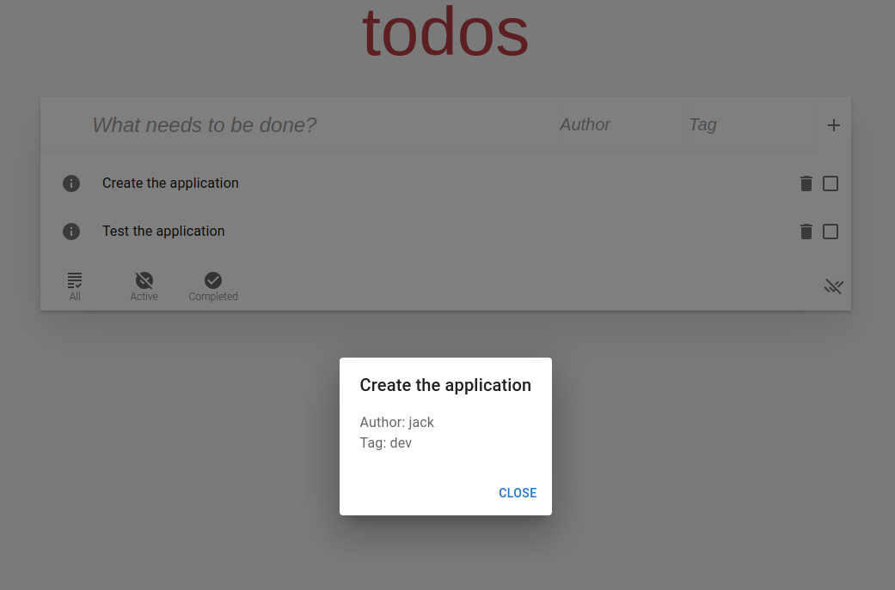

# Pivo Crossover Developer Study - Experiment Statement

Group: 2  
First 2 hours: traditional approach  
Last 2 hours: Pivo (evolvable-by-design approach)  

## Experiment Prerequisites

TODO link the code space

## Getting Started


The app you will be working on is a simple todo app. 

The objective is to have an app that will look like this.  


Upon clicking on the individual todos, you have access to the details of that todo.   


An initial skeleton of the app is already provided, all you will have to do is to fill in some methods and replace some comments in specific places.

### Details
The app is composed of multiple parts with the most important ones being:
- Components
  - TodoListPage: contains the main application
  - TodoList: contains the list of todos
  - DetailDialog: contains the dialog component displaying the author and tag information of a todo
- Service
  - TodoService: contains the methods used to call the backend

You will mainly have to modify the TodoService, and slightly the TodoListPage and the TodoList.  
:warning: the TodoService needs to be implemented in a functional manner, each method returns the full list of todos.
TODO present the app more

### Procedure
There are two sets of 5 evolutions, As the first group, you will start by making the front-end implementation in a classical manner, and then apply each evolution consecutively. 

When you are ready run the command:
```sh
TODO make the script that create a branch and checks out the back
```


#### 1. Pivo implementation
TODO add specification about the script that has to be ran

To make things easier, you can check the swagger ui while coding(TODO specify how to access it) or the openapi specification directly(TODO provide the access to the file)  

1. First implementation
   1. Instantiate the service in the todolistpage(You will have to modify The todoService and the TodoList component, you can get inspiration from the [tutorial](https://github.com/CharlyReux/evolvable-by-design-tutorial/blob/main/tutorial.md#setting-up-pivo-in-our-application) we did earlier)
   2. Modify the TodoList component to use semantic data(You can use the utilitary component `with-semantic-data-required.jsx`)
   3. Implement the methods in the TodoService
   4. Once done, run the following command: TODO `Add the command form the script` 
2. Add a required `dueDate` body parameter of type string to POST /todo.
3. Move `dueDate` attributes of Todo inside a new element `infos`.
   1. The easier way is to modify the todoService to modify the content of the todo back to its original form.
4. Move the `completed` element inside the existing `infos`
   1. The fix is similar to the previous one.
5. Completely Remove the `dueDate` return value from the infos response.
6. move the location of the id parameter from the path to the query in the GET tag method 


#### 2. Classical implementation
TODO add spec about the pivo implementation
TODO add specification about the script that has to be ran

1. First implementation
   1. Instantiate the service in the todolistpage
   2. Modify the TodoList component to use semantic data(You can use the utilitary component `with-semantic-data-required.jsx`)
   3. Implement the methods in the TodoService
   4. Once done, run the following command: TODO `Add the command form the script` 
2. Renamed GET /todos into GET /todo
3. Renamed `title` into `text` in the todo creation POST method
4. combine method GET `/todo/{todoId}/author` and GET `/todo/{todoId}/tag` to GET `/todo/{todoId}/details`
5. Change PUT /todo/{todoId} into POST /todo/{todoId}
6. To delete a todo, first complete it and then run delete, before it was possible to delete right away.
   1. For this evolution, you will have to change the todoList component to display the "deleteMany" button only when the filter is set to "completed"

